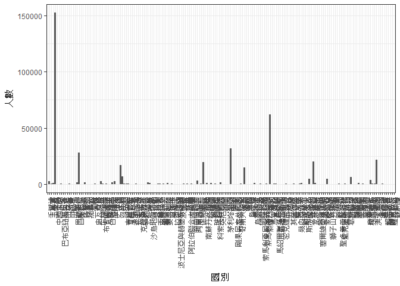
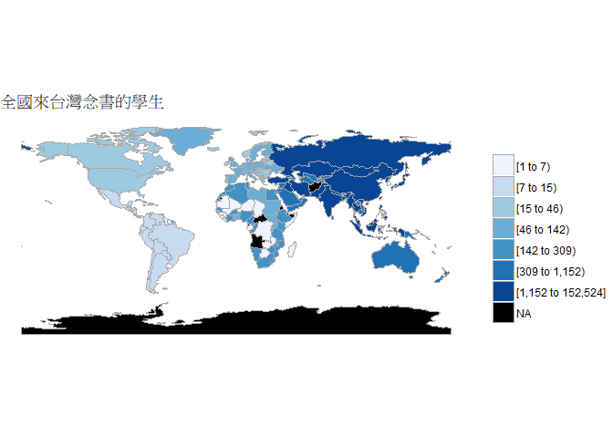
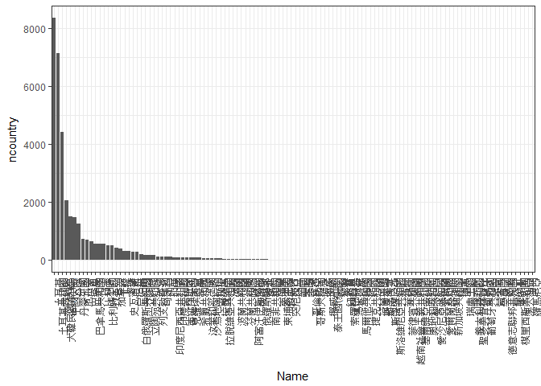
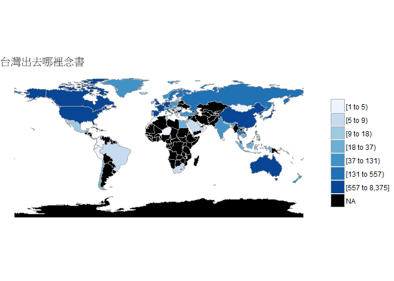
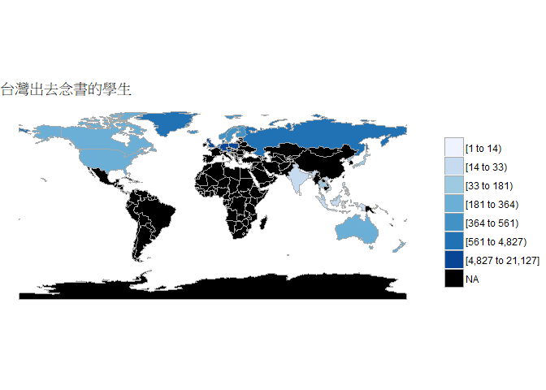

106-2 大數據分析方法 作業二
================
Yi-Ju Tseng

作業完整說明[連結](https://docs.google.com/document/d/1aLGSsGXhgOVgwzSg9JdaNz2qGPQJSoupDAQownkGf_I/edit?usp=sharing)

學習再也不限定在自己出生的國家，台灣每年有許多學生選擇就讀國外的大專院校，同時也有人多國外的學生來台灣就讀，透過分析[大專校院境外學生人數統計](https://data.gov.tw/dataset/6289)、[大專校院本國學生出國進修交流數](https://data.gov.tw/dataset/24730)、[世界各主要國家之我國留學生人數統計表](https://ws.moe.edu.tw/Download.ashx?u=C099358C81D4876CC7586B178A6BD6D5062C39FB76BDE7EC7685C1A3C0846BCDD2B4F4C2FE907C3E7E96F97D24487065577A728C59D4D9A4ECDFF432EA5A114C8B01E4AFECC637696DE4DAECA03BB417&n=4E402A02CE6F0B6C1B3C7E89FDA1FAD0B5DDFA6F3DA74E2DA06AE927F09433CFBC07A1910C169A1845D8EB78BD7D60D7414F74617F2A6B71DC86D17C9DA3781394EF5794EEA7363C&icon=..csv)可以了解103年以後各大專院校國際交流的情形。請同學分析以下議題，並以視覺化的方式呈現分析結果，呈現103年以後大專院校國際交流的情形。

來台境外生分析
--------------

### 資料匯入與處理

``` r
#這是R Code Chunk
library(readr)
```

    ## Warning: package 'readr' was built under R version 3.4.4

``` r
comeincountry103<-read_csv("https://quality.data.gov.tw/dq_download_csv.php?nid=6289&md5_url=25f64d5125016dcd6aed42e50c972ed0")
```

    ## Parsed with column specification:
    ## cols(
    ##   洲別 = col_character(),
    ##   國別 = col_character(),
    ##   `學位生-正式修讀學位外國生` = col_integer(),
    ##   `學位生-僑生(含港澳)` = col_integer(),
    ##   `學位生-正式修讀學位陸生` = col_integer(),
    ##   `非學位生-外國交換生` = col_integer(),
    ##   `非學位生-外國短期研習及個人選讀` = col_integer(),
    ##   `非學位生-大專附設華語文中心學生` = col_integer(),
    ##   `非學位生-大陸研修生` = col_integer(),
    ##   `非學位生-海青班` = col_integer(),
    ##   境外專班 = col_integer()
    ## )

``` r
comeinschool103<-read_csv("https://quality.data.gov.tw/dq_download_csv.php?nid=6289&md5_url=a6d1469f39fe41fb81dbfc373aef3331")
```

    ## Parsed with column specification:
    ## cols(
    ##   學校類型 = col_character(),
    ##   學校代碼 = col_character(),
    ##   學校名稱 = col_character(),
    ##   `學位生-正式修讀學位外國生` = col_integer(),
    ##   `學位生-僑生(含港澳)` = col_integer(),
    ##   `學位生-正式修讀學位陸生` = col_integer(),
    ##   `非學位生-外國交換生` = col_integer(),
    ##   `非學位生-外國短期研習及個人選讀` = col_integer(),
    ##   `非學位生-大專附設華語文中心學生` = col_integer(),
    ##   `非學位生-大陸研修生` = col_character(),
    ##   `非學位生-海青班` = col_integer(),
    ##   境外專班 = col_integer()
    ## )

``` r
comeincountry104<-read_csv("https://quality.data.gov.tw/dq_download_csv.php?nid=6289&md5_url=4d3e9b37b7b0fd3aa18a388cdbc77996")
```

    ## Parsed with column specification:
    ## cols(
    ##   洲別 = col_character(),
    ##   國別 = col_character(),
    ##   `學位生-正式修讀學位外國生` = col_integer(),
    ##   `學位生-僑生(含港澳)` = col_integer(),
    ##   `學位生-正式修讀學位陸生` = col_integer(),
    ##   `非學位生-外國交換生` = col_integer(),
    ##   `非學位生-外國短期研習及個人選讀` = col_integer(),
    ##   `非學位生-大專附設華語文中心學生` = col_integer(),
    ##   `非學位生-大陸研修生` = col_integer(),
    ##   `非學位生-海青班` = col_integer(),
    ##   境外專班 = col_integer()
    ## )

``` r
comeinschool104<-read_csv("https://quality.data.gov.tw/dq_download_csv.php?nid=6289&md5_url=8baeae81cba74f35cf0bb1333d3d99f5")
```

    ## Parsed with column specification:
    ## cols(
    ##   學校類型 = col_character(),
    ##   學校代碼 = col_character(),
    ##   學校名稱 = col_character(),
    ##   `學位生-正式修讀學位外國生` = col_integer(),
    ##   `學位生-僑生(含港澳)` = col_integer(),
    ##   `學位生-正式修讀學位陸生` = col_integer(),
    ##   `非學位生-外國交換生` = col_integer(),
    ##   `非學位生-外國短期研習及個人選讀` = col_integer(),
    ##   `非學位生-大專附設華語文中心學生` = col_integer(),
    ##   `非學位生-大陸研修生` = col_character(),
    ##   `非學位生-海青班` = col_integer(),
    ##   境外專班 = col_integer()
    ## )

``` r
comeincountry105<-read_csv("https://quality.data.gov.tw/dq_download_csv.php?nid=6289&md5_url=19bedf88cf46999da12513de755c33c6")
```

    ## Parsed with column specification:
    ## cols(
    ##   洲別 = col_character(),
    ##   國別 = col_character(),
    ##   學位生_正式修讀學位外國生 = col_integer(),
    ##   `學位生_僑生(含港澳)` = col_integer(),
    ##   學位生_正式修讀學位陸生 = col_integer(),
    ##   非學位生_外國交換生 = col_integer(),
    ##   非學位生_外國短期研習及個人選讀 = col_integer(),
    ##   非學位生_大專附設華語文中心學生 = col_integer(),
    ##   非學位生_大陸研修生 = col_integer(),
    ##   非學位生_海青班 = col_integer(),
    ##   境外專班 = col_integer()
    ## )

``` r
comeinschool105<-read_csv("https://quality.data.gov.tw/dq_download_csv.php?nid=6289&md5_url=1a485383cf9995da679c3798ab4fd681")
```

    ## Parsed with column specification:
    ## cols(
    ##   學校類型 = col_character(),
    ##   學校代碼 = col_character(),
    ##   學校名稱 = col_character(),
    ##   學位生_正式修讀學位外國生 = col_integer(),
    ##   `學位生_僑生(含港澳)` = col_integer(),
    ##   學位生_正式修讀學位陸生 = col_integer(),
    ##   非學位生_外國交換生 = col_integer(),
    ##   非學位生_外國短期研習及個人選讀 = col_integer(),
    ##   非學位生_大專附設華語文中心學生 = col_integer(),
    ##   非學位生_大陸研修生 = col_integer(),
    ##   非學位生_海青班 = col_integer(),
    ##   境外專班 = col_integer()
    ## )

``` r
comeincountry106<-read_csv("https://quality.data.gov.tw/dq_download_csv.php?nid=6289&md5_url=50e3370f9f8794f2054c0c82a2ed8c91")
```

    ## Parsed with column specification:
    ## cols(
    ##   洲別 = col_character(),
    ##   國別 = col_character(),
    ##   學位生_正式修讀學位外國生 = col_integer(),
    ##   `學位生_僑生(含港澳)` = col_integer(),
    ##   學位生_正式修讀學位陸生 = col_integer(),
    ##   非學位生_外國交換生 = col_integer(),
    ##   非學位生_外國短期研習及個人選讀 = col_integer(),
    ##   非學位生_大專附設華語文中心學生 = col_integer(),
    ##   非學位生_大陸研修生 = col_integer(),
    ##   非學位生_海青班 = col_integer(),
    ##   境外專班 = col_integer()
    ## )

``` r
comeinschool106<-read_csv("https://quality.data.gov.tw/dq_download_csv.php?nid=6289&md5_url=883e2ab4d5357f70bea9ac44a47d05cc")
```

    ## Parsed with column specification:
    ## cols(
    ##   學校類型 = col_character(),
    ##   學校代碼 = col_character(),
    ##   學校名稱 = col_character(),
    ##   學位生_正式修讀學位外國生 = col_integer(),
    ##   `學位生_僑生(含港澳)` = col_integer(),
    ##   學位生_正式修讀學位陸生 = col_integer(),
    ##   非學位生_外國交換生 = col_integer(),
    ##   非學位生_外國短期研習及個人選讀 = col_integer(),
    ##   非學位生_大專附設華語文中心學生 = col_integer(),
    ##   非學位生_大陸研修生 = col_integer(),
    ##   非學位生_海青班 = col_integer(),
    ##   境外專班 = col_integer()
    ## )

### 哪些國家來台灣唸書的學生最多呢？

``` r
#這是R Code Chunk
sortintaiwan103<-data.frame(Name=comeincountry103$`國別`,
                         people103=(comeincountry103$`學位生-正式修讀學位外國生`+
                                        comeincountry103$`學位生-僑生(含港澳)`+
                                        comeincountry103$`學位生-正式修讀學位陸生`+
                          comeincountry103$`非學位生-外國交換生`+
                           comeincountry103$`非學位生-外國短期研習及個人選讀`+
                           comeincountry103$`非學位生-大專附設華語文中心學生`+
                           comeincountry103$`非學位生-大陸研修生`+
                           comeincountry103$`非學位生-海青班`+
                           comeincountry103$`境外專班`))

sortintaiwan104<-data.frame(Name=comeincountry104$`國別`,
                            people104=(comeincountry104$`學位生-正式修讀學位外國生`+
                                        comeincountry104$`學位生-僑生(含港澳)`+
                                        comeincountry104$`學位生-正式修讀學位陸生`+
                                         comeincountry104$`非學位生-外國交換生`+
                                         comeincountry104$`非學位生-外國短期研習及個人選讀`+
                                         comeincountry104$`非學位生-大專附設華語文中心學生`+
                                         comeincountry104$`非學位生-大陸研修生`+
                                         comeincountry104$`非學位生-海青班`+
                                         comeincountry104$`境外專班`))

sortintaiwan105<-data.frame(Name=comeincountry105$`國別`,
                         people105=(comeincountry105$`學位生_正式修讀學位外國生`+
                                      comeincountry105$`學位生_僑生(含港澳)`+
                                      comeincountry105$`學位生_正式修讀學位陸生`+
                                      comeincountry105$`非學位生_外國交換生`+
                                      comeincountry105$`非學位生_外國短期研習及個人選讀`+
                                      comeincountry105$`非學位生_大專附設華語文中心學生`+
                                      comeincountry105$`非學位生_大陸研修生`+
                                      comeincountry105$`非學位生_海青班`+
                                      comeincountry105$`境外專班`))

sortintaiwan106<-data.frame(Name=comeincountry106$`國別`,
                         people106=(comeincountry106$`學位生_正式修讀學位外國生`+
                                        comeincountry106$`學位生_僑生(含港澳)`+
                                        comeincountry106$`學位生_正式修讀學位陸生`+
                                      comeincountry106$`非學位生_外國交換生`+
                                      comeincountry106$`非學位生_外國短期研習及個人選讀`+
                                      comeincountry106$`非學位生_大專附設華語文中心學生`+
                                      comeincountry106$`非學位生_大陸研修生`+
                                      comeincountry106$`非學位生_海青班`+
                                      comeincountry106$`境外專班`))
library(dplyr)
```

    ## 
    ## Attaching package: 'dplyr'

    ## The following objects are masked from 'package:stats':
    ## 
    ##     filter, lag

    ## The following objects are masked from 'package:base':
    ## 
    ##     intersect, setdiff, setequal, union

``` r
sortintaiwan103104<-full_join(sortintaiwan103,sortintaiwan104,by="Name")
```

    ## Warning: Column `Name` joining factors with different levels, coercing to
    ## character vector

``` r
sortintaiwan103104105<-full_join(sortintaiwan103104,sortintaiwan105,by="Name")
```

    ## Warning: Column `Name` joining character vector and factor, coercing into
    ## character vector

``` r
sortintaiwanall<-full_join(sortintaiwan103104105,sortintaiwan106,by="Name")
```

    ## Warning: Column `Name` joining character vector and factor, coercing into
    ## character vector

``` r
sortintaiwanall$people103<-as.numeric(sortintaiwanall$people103)
sortintaiwanall$people104<-as.numeric(sortintaiwanall$people104)
sortintaiwanall$people105<-as.numeric(sortintaiwanall$people105)
sortintaiwanall$people106<-as.numeric(sortintaiwanall$people106)
#把NA轉0
sortintaiwanall[is.na(sortintaiwanall)]<-0

sortintaiwanall$total<-(sortintaiwanall$people103+sortintaiwanall$people104+
                          sortintaiwanall$people105+sortintaiwanall$people106)

sortintaiwanall$total<-sort(sortintaiwanall$total,decreasing = T)


library(knitr)
```

    ## Warning: package 'knitr' was built under R version 3.4.4

``` r
knitr::kable(head(sortintaiwanall,10))
```

| Name     |  people103|  people104|  people105|  people106|   total|
|:---------|----------:|----------:|----------:|----------:|-------:|
| 中國大陸 |      33288|      41951|      41981|      35304|  152524|
| 馬來西亞 |      13385|      15054|      16311|      17281|   62031|
| 香港     |       6286|       8233|       8660|       8761|   31940|
| 日本     |       5816|       6455|       7542|       8387|   28200|
| 澳門     |       4723|       5152|       5286|       5141|   21670|
| 越南     |       4005|       4459|       5342|       7864|   20302|
| 南韓     |       3587|       4062|       4575|       4724|   19620|
| 印尼     |       3559|       4454|       5154|       6453|   16948|
| 泰國     |       1535|       1591|       1771|       2138|   14846|
| 印度     |        857|       1163|       1293|       1532|    7035|

### 哪間大學的境外生最多呢？

``` r
#這是R Code Chunk
comeinschool103$`非學位生-大陸研修生`<-gsub("…",0,comeinschool103$`非學位生-大陸研修生`)
comeinschool104$`非學位生-大陸研修生`<-gsub("…",0,comeinschool104$`非學位生-大陸研修生`)

comeinschool103$`非學位生-大陸研修生`<-as.numeric(comeinschool103$`非學位生-大陸研修生`)
comeinschool104$`非學位生-大陸研修生`<-as.numeric(comeinschool104$`非學位生-大陸研修生`)


sortschool103<-data.frame(Name=comeinschool103$`學校名稱`,
                people103=comeinschool103$`學位生-正式修讀學位外國生`+
                  comeinschool103$`學位生-僑生(含港澳)`+
                  comeinschool103$`學位生-正式修讀學位陸生`+
                  comeinschool103$`非學位生-外國交換生`+
                  comeinschool103$`非學位生-外國短期研習及個人選讀`+
                  comeinschool103$`非學位生-大專附設華語文中心學生`+
                  comeinschool103$`非學位生-大陸研修生`+
                  comeinschool103$`非學位生-海青班`+
                  comeinschool103$`境外專班`)
sortschool104<-data.frame(Name=comeinschool104$`學校名稱`,
                          people104=comeinschool104$`學位生-正式修讀學位外國生`+
                            comeinschool104$`學位生-僑生(含港澳)`+
                            comeinschool104$`學位生-正式修讀學位陸生`+
                            comeinschool104$`非學位生-外國交換生`+
                            comeinschool104$`非學位生-外國短期研習及個人選讀`+
                            comeinschool104$`非學位生-大專附設華語文中心學生`+
                            comeinschool104$`非學位生-大陸研修生`+
                            comeinschool104$`非學位生-海青班`+
                            comeinschool104$`境外專班`)
sortschool105<-data.frame(Name=comeinschool105$`學校名稱`,
                          people105=comeinschool105$`學位生_正式修讀學位外國生`+
                            comeinschool105$`學位生_僑生(含港澳)`+
                            comeinschool105$`學位生_正式修讀學位陸生`+
                            comeinschool105$`非學位生_外國交換生`+
                            comeinschool105$`非學位生_外國短期研習及個人選讀`+
                            comeinschool105$`非學位生_大專附設華語文中心學生`+
                            comeinschool105$`非學位生_大陸研修生`+
                            comeinschool105$`非學位生_海青班`+
                            comeinschool105$`境外專班`)
sortschool106<-data.frame(Name=comeinschool106$`學校名稱`,
                          people106=comeinschool106$`學位生_正式修讀學位外國生`+
                            comeinschool106$`學位生_僑生(含港澳)`+
                            comeinschool106$`學位生_正式修讀學位陸生`+
                            comeinschool106$`非學位生_外國交換生`+
                            comeinschool106$`非學位生_外國短期研習及個人選讀`+
                            comeinschool106$`非學位生_大專附設華語文中心學生`+
                            comeinschool106$`非學位生_大陸研修生`+
                            comeinschool106$`非學位生_海青班`+
                            comeinschool106$`境外專班`)

sortschool103104<-full_join(sortschool103,sortschool104,by="Name")
```

    ## Warning: Column `Name` joining factors with different levels, coercing to
    ## character vector

``` r
sortschool103104105<-full_join(sortschool103104,sortschool105,by="Name")
```

    ## Warning: Column `Name` joining character vector and factor, coercing into
    ## character vector

``` r
sortschoolall<-full_join(sortschool103104105,sortschool106,by="Name")
```

    ## Warning: Column `Name` joining character vector and factor, coercing into
    ## character vector

``` r
sortschoolall[is.na(sortschoolall)]<-0

sortschoolall$total<-(sortschoolall$people103+sortschoolall$people104+
                        sortschoolall$people105+sortschoolall$people106)

sortschoolall$total<-sort(sortschoolall$total,decreasing = T)

knitr::kable(head(sortschoolall,10))
```

| Name                   |  people103|  people104|  people105|  people106|  total|
|:-----------------------|----------:|----------:|----------:|----------:|------:|
| 國立政治大學           |       2705|       2871|       2989|       3061|  92586|
| 國立清華大學           |        853|        976|       1149|       1764|  22113|
| 國立臺灣大學           |       3800|       4514|       4817|       5068|  18199|
| 國立臺灣師範大學       |       4648|       5328|       5709|       6428|  16074|
| 國立臺灣師大僑生先修部 |       1248|        990|        850|        588|  16057|
| 國立成功大學           |       2385|       2554|       2864|       3179|  13887|
| 國立中興大學           |        751|        892|       1027|       1017|  11626|
| 國立交通大學           |       1191|       1813|       1921|       2001|  10982|
| 國立中央大學           |        663|        829|       1046|       1152|   9499|
| 國立中山大學           |       1234|       1465|       1450|       1482|   9474|

### 各個國家來台灣唸書的學生人數條狀圖

``` r
#這是R Code Chunk
library(dplyr)
library(ggplot2)
```

    ## Warning: package 'ggplot2' was built under R version 3.4.4

``` r
  ggplot(sortintaiwanall,aes(x=Name,y=total))+
  geom_bar(stat="identity")+
  labs(x="國別",y="人數")+
  theme_bw()+
  theme(axis.text.x = element_text(angle = 90 , hjust = 1))
```



### 各個國家來台灣唸書的學生人數面量圖

``` r
#這是R Code Chunk
library(ggplot2) 
library(choroplethr)
```

    ## Warning: package 'choroplethr' was built under R version 3.4.4

    ## Loading required package: acs

    ## Warning: package 'acs' was built under R version 3.4.4

    ## Loading required package: stringr

    ## Warning: package 'stringr' was built under R version 3.4.4

    ## Loading required package: XML

    ## Warning: package 'XML' was built under R version 3.4.4

    ## 
    ## Attaching package: 'acs'

    ## The following object is masked from 'package:dplyr':
    ## 
    ##     combine

    ## The following object is masked from 'package:base':
    ## 
    ##     apply

``` r
library(choroplethrMaps)
```

    ## Warning: package 'choroplethrMaps' was built under R version 3.4.4

``` r
library(readr)
library(dplyr)
CountriesComparisionTable <- read_csv("C:/Users/Jeremy/Desktop/CountriesComparisionTable.csv")
```

    ## Parsed with column specification:
    ## cols(
    ##   ISO3 = col_character(),
    ##   English = col_character(),
    ##   Taiwan = col_character()
    ## )

``` r
sortintaiwanalltwo<-data.frame(Taiwan=sortintaiwanall$Name,
                               value=sortintaiwanall$total)

sortintaiwanengchi<-inner_join(CountriesComparisionTable,sortintaiwanalltwo,by="Taiwan")
```

    ## Warning: Column `Taiwan` joining character vector and factor, coercing into
    ## character vector

``` r
sortintaiwaneng<-data.frame(region=sortintaiwanengchi$English,
                            value=sortintaiwanengchi$value)

sortintaiwaneng$value[is.na(sortintaiwaneng$value)]<-0

sortintaiwaneng<-sortintaiwaneng[sortintaiwaneng$region!="Unmatch",]
sortintaiwaneng<-sortintaiwaneng[sortintaiwaneng$value!=0,]

sortintaiwanengpic<-group_by(sortintaiwaneng,region)%>%
  summarise(value=sum(value))


country_choropleth(sortintaiwanengpic,
                   "全國來台灣念書的學生")
```

    ## Warning in super$initialize(country.map, user.df): Your data.frame contains
    ## the following regions which are not mappable: Singapore

    ## Warning: Column `region` joining character vector and factor, coercing into
    ## character vector

    ## Warning in self$bind(): The following regions were missing and are
    ## being set to NA: afghanistan, angola, montenegro, qatar, western sahara,
    ## somaliland, east timor, taiwan, vanuatu, central african republic, northern
    ## cyprus, djibouti, eritrea, antarctica, equatorial guinea, kosovo, lesotho



台灣學生國際交流分析
--------------------

### 資料匯入與處理

``` r
#這是R Code Chunk
goout105 <- read.csv("C:/Users/Jeremy/Desktop/Student_RPT_07.csv")
```

### 台灣大專院校的學生最喜歡去哪些國家進修交流呢？

``` r
#這是R Code Chunk
goout105<-filter(goout105,`學年度`>=103)
```

    ## Warning: package 'bindrcpp' was built under R version 3.4.4

``` r
gooutschool<-data.frame(Name=goout105$`對方學校.機構.國別.地區.`,
                        people=goout105$`本國學生出國進修.交流人數.小計.`)
group<-group_by(gooutschool,Name)%>%
  summarise(ncountry=sum(people))

group$ncountry<-sort(group$ncountry,decreasing = T)

knitr::kable(head(group,10))
```

| Name           |  ncountry|
|:---------------|---------:|
| 土耳其         |      8375|
| 土耳其共和國   |      7142|
| 大陸地區       |      4427|
| 大韓民國(南韓) |      2050|
| 中國大陸       |      1516|
| 丹麥           |      1466|
| 丹麥王國       |      1258|
| 厄瓜多         |       742|
| 巴西           |       689|
| 巴拿馬         |       642|

### 哪間大學的出國交流學生數最多呢？

``` r
#這是R Code Chunk
goouttwschool<-data.frame(Name=goout105$`學校名稱`,
                          people=goout105$`本國學生出國進修.交流人數.小計.`)
groupupschool<-group_by(goouttwschool,Name)%>%
  summarise(nschool=sum(people))

groupupschool$nschool<-sort(groupupschool$nschool,decreasing = T)

knitr::kable(head(groupupschool,10))
```

| Name                         |  nschool|
|:-----------------------------|--------:|
| 大仁科技大學                 |     2224|
| 大同大學                     |     2038|
| 大華學校財團法人大華科技大學 |     1876|
| 大葉大學                     |     1346|
| 中山醫學大學                 |     1106|
| 中州學校財團法人中州科技大學 |      956|
| 中原大學                     |      951|
| 中國文化大學                 |      931|
| 中國科技大學                 |      873|
| 中國醫藥大學                 |      846|

### 台灣大專院校的學生最喜歡去哪些國家進修交流條狀圖

``` r
#這是R Code Chunk
library(dplyr)
library(ggplot2)
group%>%
  ggplot(aes(x=Name,y=ncountry))+
  geom_bar(stat="identity")+
  theme_bw()+
  theme(axis.text.x = element_text(angle = 90 , hjust = 1))
```



### 台灣大專院校的學生最喜歡去哪些國家進修交流面量圖

``` r
#這是R Code Chunk
library(ggplot2) 
library(choroplethr)
library(choroplethrMaps)
library(readr)
library(dplyr)
CountriesComparisionTable <- read_csv("C:/Users/Jeremy/Desktop/CountriesComparisionTable.csv")
```

    ## Parsed with column specification:
    ## cols(
    ##   ISO3 = col_character(),
    ##   English = col_character(),
    ##   Taiwan = col_character()
    ## )

``` r
gooutschooltwo<-data.frame(Taiwan=gooutschool$Name,
                            value=gooutschool$people)

gooutschoolengchi<-inner_join(CountriesComparisionTable,gooutschooltwo,by="Taiwan")
```

    ## Warning: Column `Taiwan` joining character vector and factor, coercing into
    ## character vector

``` r
gooutschooleng<-data.frame(region=gooutschoolengchi$English,
                            value=gooutschoolengchi$value)

gooutschooleng$value[is.na(gooutschooleng$value)]<-0


gooutschoolengpic<-group_by(gooutschooleng,region)%>%
  summarise(value=sum(value))


country_choropleth(gooutschoolengpic,
                   "台灣出去哪裡念書")
```

    ## Warning in super$initialize(country.map, user.df): Your data.frame contains
    ## the following regions which are not mappable: Singapore, Unmatch

    ## Warning: Column `region` joining character vector and factor, coercing into
    ## character vector

    ## Warning in self$bind(): The following regions were missing and are being
    ## set to NA: afghanistan, angola, azerbaijan, moldova, madagascar, macedonia,
    ## mali, myanmar, montenegro, mozambique, mauritania, burundi, namibia,
    ## nigeria, nicaragua, pakistan, papua new guinea, benin, paraguay, rwanda,
    ## western sahara, sudan, burkina faso, south sudan, senegal, sierra leone,
    ## el salvador, somaliland, somalia, suriname, syria, chad, togo, tajikistan,
    ## turkmenistan, east timor, bulgaria, trinidad and tobago, taiwan, united
    ## republic of tanzania, uganda, ukraine, uruguay, uzbekistan, the bahamas,
    ## venezuela, vanuatu, yemen, zambia, zimbabwe, bosnia and herzegovina,
    ## belarus, albania, belize, bolivia, bhutan, botswana, central african
    ## republic, united arab emirates, ivory coast, cameroon, democratic republic
    ## of the congo, republic of congo, cuba, northern cyprus, cyprus, argentina,
    ## djibouti, dominican republic, algeria, eritrea, armenia, ethiopia,
    ## fiji, gabon, georgia, ghana, antarctica, guinea, gambia, guinea bissau,
    ## equatorial guinea, guatemala, guyana, honduras, haiti, iran, iraq, jamaica,
    ## kazakhstan, kenya, kyrgyzstan, kosovo, laos, lebanon, liberia, libya,
    ## lesotho, luxembourg



台灣學生出國留學分析
--------------------

### 資料匯入與處理

``` r
#這是R Code Chunk
pop105 <- read_csv("C:/Users/Jeremy/Desktop/pop105.csv")
```

    ## Warning: Missing column names filled in: 'X4' [4], 'X5' [5], 'X6' [6]

    ## Parsed with column specification:
    ## cols(
    ##   洲別 = col_character(),
    ##   國別 = col_character(),
    ##   總人數 = col_number(),
    ##   X4 = col_character(),
    ##   X5 = col_character(),
    ##   X6 = col_character()
    ## )

### 台灣學生最喜歡去哪些國家留學呢？

``` r
pop105<-pop105[1:3]
pop105$總人數<- sort(pop105$總人數,decreasing = T)

knitr::kable(head(pop105,10))
```

| 洲別 | 國別   | 總人數 |
|:-----|:-------|:------:|
| 歐洲 | 英國   |  21127 |
| 歐洲 | 德國   |  13582 |
| 歐洲 | 波蘭   |  8444  |
| 歐洲 | 奧地利 |  4827  |
| 歐洲 | 俄羅斯 |  3815  |
| 歐洲 | 丹麥   |  1488  |
| 歐洲 | 比利時 |  1106  |
| 歐洲 | 荷蘭   |   561  |
| 歐洲 | 芬蘭   |   502  |
| 歐洲 | 挪威   |   419  |

### 台灣學生最喜歡去哪些國家留學面量圖

``` r
library(ggplot2) 
library(choroplethr)
library(choroplethrMaps)
library(readr)
library(dplyr)
CountriesComparisionTable <- read_csv("C:/Users/Jeremy/Desktop/CountriesComparisionTable.csv")
```

    ## Parsed with column specification:
    ## cols(
    ##   ISO3 = col_character(),
    ##   English = col_character(),
    ##   Taiwan = col_character()
    ## )

``` r
pop105two<-data.frame(Taiwan=pop105$`國別`,
                      value=pop105$`總人數`)

pop105engchi<-inner_join(CountriesComparisionTable,pop105two,by="Taiwan")
```

    ## Warning: Column `Taiwan` joining character vector and factor, coercing into
    ## character vector

``` r
pop105eng<-data.frame(region=pop105engchi$English,
                           value=pop105engchi$value)

pop105eng$value[is.na(pop105eng$value)]<-0


pop105engpic<-group_by(pop105eng,region)%>%
  summarise(value=sum(value))


country_choropleth(pop105engpic,
                   "台灣出去念書的學生")
```

    ## Warning in super$initialize(country.map, user.df): Your data.frame contains
    ## the following regions which are not mappable: Singapore

    ## Warning: Column `region` joining character vector and factor, coercing into
    ## character vector

    ## Warning in self$bind(): The following regions were missing and are being
    ## set to NA: afghanistan, angola, azerbaijan, moldova, madagascar, mexico,
    ## macedonia, mali, myanmar, montenegro, mongolia, mozambique, mauritania,
    ## burundi, malawi, namibia, france, niger, nigeria, nicaragua, oman,
    ## pakistan, panama, peru, papua new guinea, benin, portugal, paraguay,
    ## israel, qatar, romania, rwanda, western sahara, saudi arabia, sudan,
    ## burkina faso, south sudan, senegal, solomon islands, sierra leone, el
    ## salvador, somaliland, somalia, republic of serbia, suriname, slovakia,
    ## slovenia, swaziland, syria, chad, togo, tajikistan, turkmenistan, east
    ## timor, bulgaria, trinidad and tobago, tunisia, turkey, taiwan, united
    ## republic of tanzania, uganda, ukraine, uruguay, uzbekistan, the bahamas,
    ## venezuela, vanuatu, yemen, south africa, zambia, zimbabwe, bosnia and
    ## herzegovina, belarus, albania, belize, bolivia, brazil, bhutan, botswana,
    ## central african republic, switzerland, chile, united arab emirates, china,
    ## ivory coast, cameroon, democratic republic of the congo, republic of
    ## congo, colombia, costa rica, cuba, northern cyprus, cyprus, argentina,
    ## czech republic, djibouti, dominican republic, algeria, ecuador, egypt,
    ## eritrea, spain, armenia, estonia, ethiopia, fiji, gabon, georgia, ghana,
    ## antarctica, guinea, gambia, guinea bissau, equatorial guinea, greece,
    ## guatemala, guyana, honduras, croatia, haiti, hungary, ireland, iran, iraq,
    ## italy, jamaica, jordan, kazakhstan, kenya, kyrgyzstan, cambodia, south
    ## korea, kosovo, kuwait, laos, lebanon, liberia, libya, lesotho, lithuania,
    ## luxembourg, latvia, morocco



綜合分析
--------

請問來台讀書與離台讀書的來源國與留學國趨勢是否相同(5分)？想來台灣唸書的境外生，他們的母國也有很多台籍生嗎？請圖文並茂說明你的觀察(10分)。

我用ggplot做出來的趨勢圖 library(ggplot2) ggplot(group, aes(x=Name,y=ncountry))+ geom\_point()+ geom\_smooth(method = 'lm')

ggplot(sortintaiwanall, aes(x=Name,y=total))+ geom\_point()+ geom\_smooth(method = 'lm') 趨勢還蠻不一樣的耶，來台灣念書的好像相對比較少 從台灣出去念書的學生越來越多了。 我是以中國大陸來看，看起來是台灣去那邊讀書的很多 ，大陸生來台灣念書的也蠻多的。
